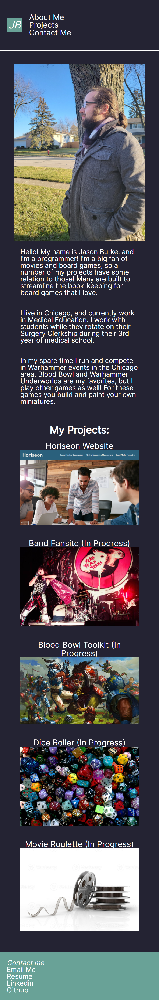

# hw2

## Description

This is my portfolio of work samples. We have not developed many apps yet, so some of these are placeholders for things I would like to complete in the future.

The portfolio has my personal info, a photo, and sections about me, my work, and how to contact me. The UI is responsive to clicks on the Nav bar to move around the site. The first image is larger in size than the others in full screen view. When you resize the page, the layout adapts based on screen size using media queries.

## Screenshots

## Links to application

\*Here is the link to the repo: [jasonburke/repo](https://github.com/Jasonsburke90/hw2)

\*Here is the link to the pages: [jasonburke/pages](https://jasonsburke90.github.io/hw2/)
